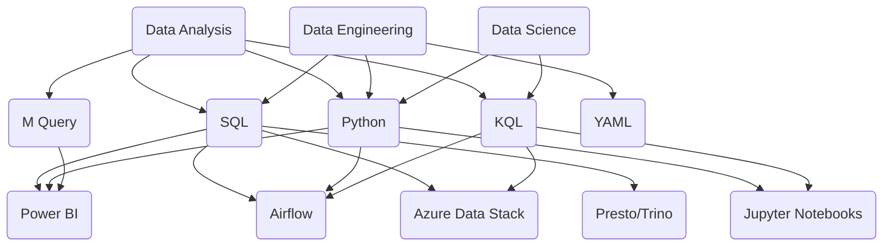

## Hi there! 👋 I'm [Rafa!](https://github.com/rklie)

### I'm a Data Analyst for the Enterprise & Core Metrics team @ GitHub.

- 👨🏻‍💻 I'm currently focused on applying fresh knowledge about ADX (Kusto), Airflow Data Pipelines & Power BI M-queries. 
- 🎮 Veteran and Zelda fan - Proud father of 1 👧🏼
- 💪🏻 At the moment I'm learning more about Data Engineering, Data Modeling and AI/ML technologies. 

❗️ Some details about the languages and platforms I'm currently using:

