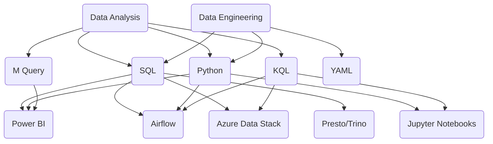

## Hi there! 👋 I'm [Rafa!](https://github.com/rklie)

### I'm a Data Engineer for the Enterprise & Core Metrics team @ GitHub.

- 🚀 Currently, I'm diving deep into the world of ADX (Kusto), mastering Airflow Data Pipelines, and exploring the intricacies of Power BI M-queries.
- 🎮 Self-appointed veteran gamer and an avid fan of Zelda - Also a proud parent to a wonderful daughter 👧🏼
- 👨🏻‍💻 I'm on a journey to expand my skills in Data Engineering, Data Modeling, and cutting-edge AI/ML technologies.

❗️ Some details about the languages and platforms I'm currently using:

