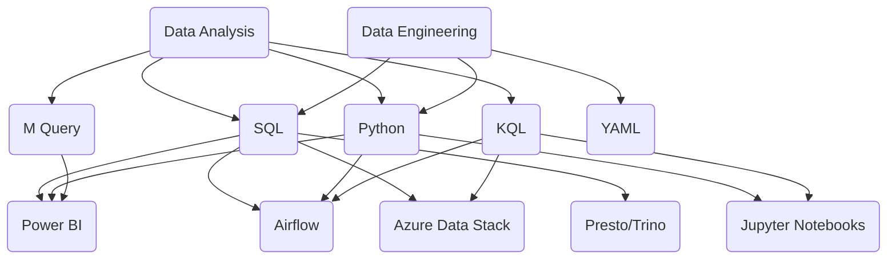

## Hi there! 👋 I'm [Rafa!](https://github.com/rklie)

### I'm a Data Analytics Engineer for the Data organization @ GitHub.

- 🚀 Currently, I'm diving deep into the world of ADX (Kusto), mastering Airflow, and exploring anything and everything about data modeling and orchestration.
- 🎮 Self-appointed veteran gamer and an avid fan of Zelda - Also a proud parent to two wonderful daughters 👧🏼👧🏼
- 👨🏻‍💻 I'm on a journey to expand my skills in Data Engineering, Data Modeling, and cutting-edge AI technologies.

❗️ Some details about the languages and platforms I'm currently using:

```mermaid
flowchart TD
    A(Data Analysis) --> D(SQL) & E(Python) & F(KQL) & G(M Query)
    B(Data Engineering) --> D & E & H(YAML)
    D & E & G --> I(Power BI)
    D & E & F --> J(Airflow)
    D & F --> K(Azure Data Stack)
    E & F --> L(Jupyter Notebooks)
    D --> M(Presto/Trino)
```
